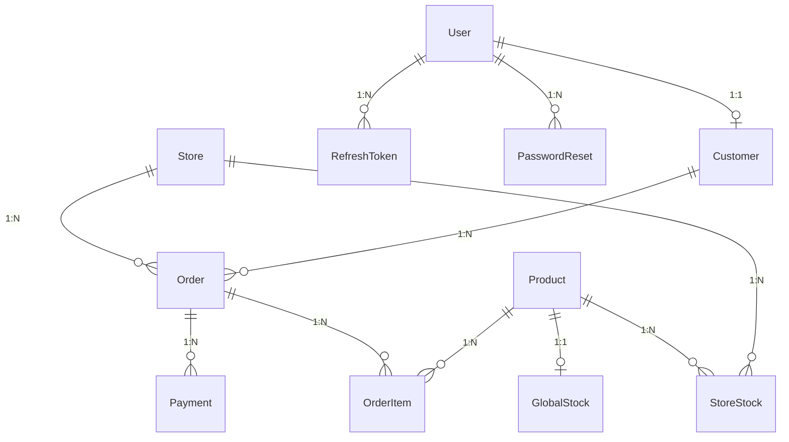

# Diagrama Entidade-Relacionamento (DER)

Modelo derivado do `prisma/schema.prisma`, compativel com o banco PostgreSQL da API.

## Visualizacao



> Imagem estatica: [`DER.png`](./DER.png) (gerada a partir de [`DER.mmd`](./DER.mmd)).

## Tabelas principais

| Tabela | Descricao |
|---|---|
| `User` | Usuarios do sistema (admin, staff, customer) |
| `Customer` | Dados do cliente + consentimento LGPD + pontos de fidelidade |
| `Store` | Unidades da rede |
| `Product` | Produtos do cardapio |
| `StoreStock` | Estoque por unidade (PK composta logica storeId+productId) |
| `GlobalStock` | Estoque central por produto |
| `Order` | Pedidos com canal de origem e status |
| `OrderItem` | Itens do pedido com preco congelado |
| `Payment` | Registros do pagamento mock (request/response JSON) |
| `refresh_tokens` | Tokens de refresh JWT |
| `password_resets` | Tokens de redefinicao de senha |

## Enums

| Enum | Valores |
|---|---|
| `Role` | CUSTOMER, ADMIN, STAFF |
| `Channel` | WEB, APP, TOTEM, IN_STORE, PICKUP |
| `OrderStatus` | PENDING, IN_KITCHEN, READY, DELIVERED, CANCELLED |
| `PaymentStatus` | PENDING, SUCCESS, FAILED, CANCELLED |

## Restricoes relevantes

- Cada `Customer` pertence a um unico `User` (1:1).
- Cada unidade possui estoque proprio em `StoreStock`.
- Pedido possui itens e pagamentos desacoplados (N:1 com Order).
- CPF e e-mail sao unicos onde aplicavel.

## Como regenerar a imagem

```bash
npx -p @mermaid-js/mermaid-cli mmdc -i docs/DER.mmd -o docs/DER.png -b transparent
```
