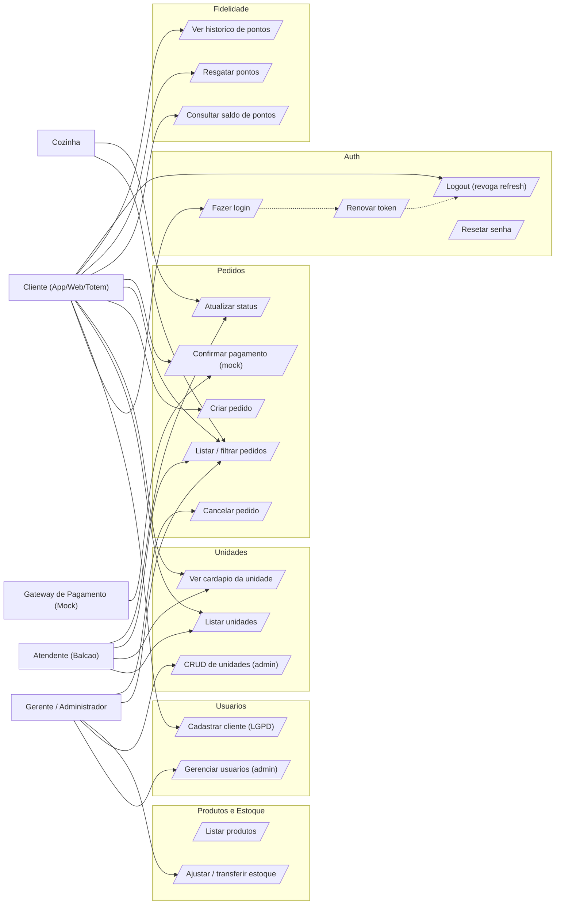
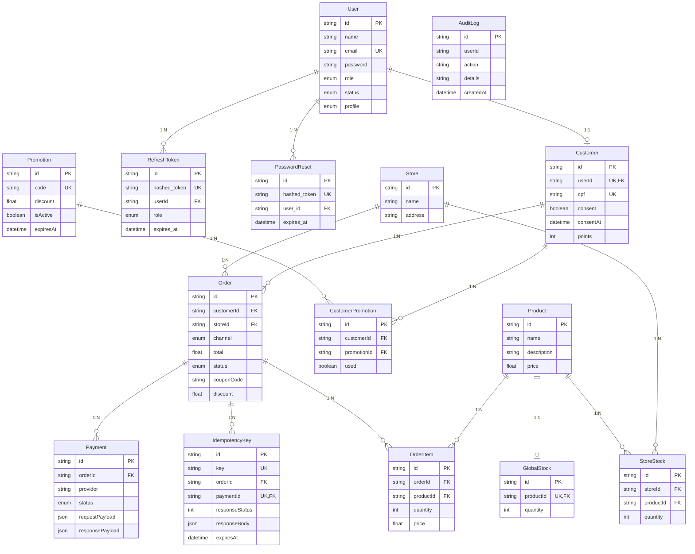
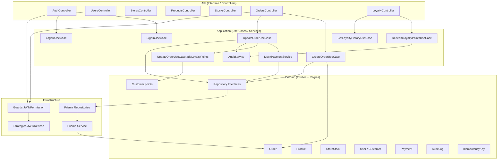
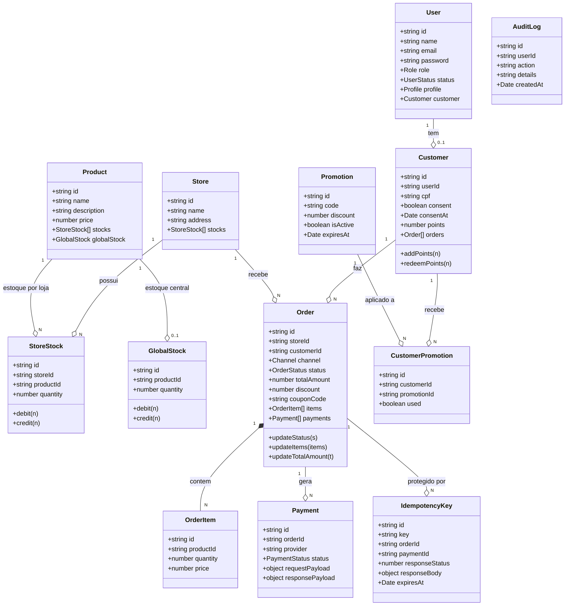
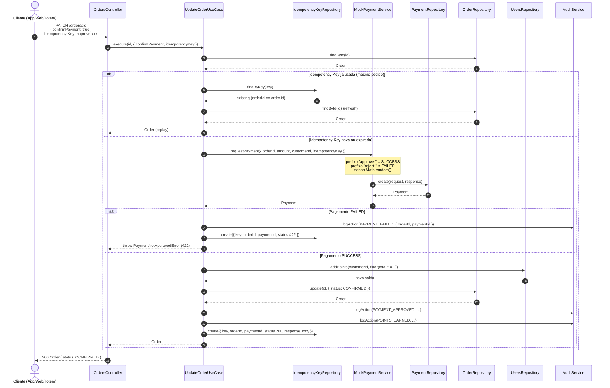
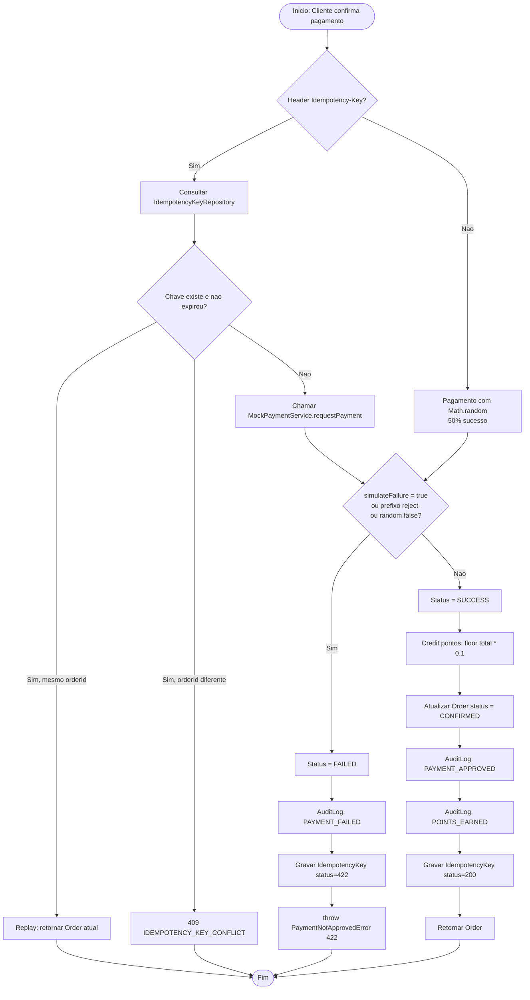

# Diagramas do Projeto

Todos os diagramas abaixo estao em **Mermaid** e foram gerados a partir do `prisma/schema.prisma`, dos casos de uso implementados e do fluxo critico do projeto (Pedido → Pagamento mock → Atualizacao de status). Podem ser renderizados direto no GitHub, em IDEs (VS Code com extensao Mermaid) ou via `mermaid-cli`.

> Imagem estatica do DER: [`DER.png`](./DER.png) — gerada a partir de [`DER.mmd`](./DER.mmd).

---

## 1. Diagrama de Casos de Uso

Atores e casos de uso cobertos pela API. Os casos estao agrupados por modulo.



### Descricao dos casos de uso principais

#### UC-CRIT-1 — Criar Pedido

| Campo | Descricao |
|---|---|
| **Ator principal** | Cliente (App/Web/Totem) |
| **Pre-condicoes** | Cliente autenticado (JWT); unidade e produtos existem; ha estoque disponivel |
| **Pos-condicoes** | Pedido criado em status `PENDING`; estoque da unidade debitado; `AuditLog` registrado |
| **Fluxo principal** | 1. Cliente envia `POST /orders` com `storeId`, `channel`, `items[]`. 2. Sistema valida unidade e produtos. 3. Sistema valida estoque por item. 4. Sistema calcula total e cria o pedido. 5. Sistema debita `StoreStock`. 6. Sistema responde `201` com pedido criado. |
| **Excecoes** | `404` unidade/produto inexistente; `409` estoque insuficiente; `422` payload invalido; `401/403` sem permissao |
| **Regras de negocio** | `channel` obrigatorio; quantidade > 0; preco congelado no item no momento da criacao |

#### UC-CRIT-2 — Confirmar Pagamento (Mock + Idempotencia)

| Campo | Descricao |
|---|---|
| **Ator principal** | Cliente (App/Web/Totem) |
| **Atores secundarios** | Gateway de Pagamento (Mock interno) |
| **Pre-condicoes** | Pedido existe e esta em `PENDING` ou `IN_KITCHEN`; cliente envia header `Idempotency-Key` |
| **Pos-condicoes** | Pedido movido para `CONFIRMED`; pontos creditados; `Payment` e `AuditLog` registrados |
| **Fluxo principal** | 1. Cliente envia `PATCH /orders/:id` com `{ confirmPayment: true }` e header `Idempotency-Key`. 2. Sistema consulta `IdempotencyKey`. 3. Se existir para o mesmo pedido, retorna estado atual. 4. Senao, chama `MockPaymentService.requestPayment` (deterministico pelo prefixo da chave). 5. Em sucesso: atualiza status, credita 10% do total em pontos, grava idempotency key. 6. Em falha: grava idempotency key com `422`, retorna `422 PAYMENT_FAILED`. |
| **Excecoes** | `409 IDEMPOTENCY_KEY_CONFLICT` se a chave pertence a outro pedido; `422 PAYMENT_FAILED` se mock rejeitar |
| **Regras de negocio** | Mesma chave + mesmo pedido = replay (sem novo pagamento); prefixo `approve-` aprova; prefixo `reject-` rejeita; sem prefixo = fallback 50% |

---

## 2. DER — Diagrama Entidade-Relacionamento



### Cardinalidades e restricoes principais

- `User` 1:1 `Customer` (um usuario pode ser cliente; `Customer.userId` e UNIQUE).
- `Customer` 1:N `Order` (um cliente tem varios pedidos).
- `Store` 1:N `Order` (pedidos pertecem a uma unidade).
- `Store` 1:N `StoreStock` e `Product` 1:N `StoreStock` — cada combinacao `storeId+productId` e UNIQUE.
- `Product` 1:1 `GlobalStock` (`productId` UNIQUE em `GlobalStock`).
- `Order` 1:N `OrderItem`, `Order` 1:N `Payment`, `Order` 1:N `IdempotencyKey`.
- `Promotion` 1:N `CustomerPromotion` (vinculo por cliente; cada par cliente+promocao e UNIQUE).

---

## 3. Arquitetura em camadas



---

## 4. Diagrama de Classes (dominio)



---

## 5. Fluxo critico: Pedido → Pagamento mock → Status (sequencia)



---

## 6. Fluxo critico: Pedido → Pagamento mock → Status (atividade)



---

## Como renderizar os diagramas localmente

```bash
# Instalar o CLI do Mermaid
npm i -g @mermaid-js/mermaid-cli

# Renderizar cada bloco em uma imagem (exemplo para o DER)
npx -p @mermaid-js/mermaid-cli mmdc -i docs/DER.mmd -o docs/DER.png -b transparent
```

Tambem e possivel copiar e colar cada bloco Mermaid direto em:

- GitHub (markdown nativo)
- VS Code (extensao **Markdown Preview Mermaid Support**)
- https://mermaid.live/